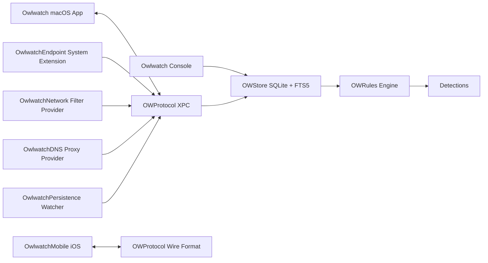

# Owlwatch

Owlwatch is an open-source Endpoint Detection and Response platform for macOS, with a companion iOS posture agent. The macOS product is designed around Endpoint Security, Network Extension, code-signing validation, persistence inspection, and a native detection rules library for identifying suspicious behavior on Apple platforms.

[](#)
[](#)
[](#)
[](#)
[](LICENSE)
[](#)
[](#)

## Demo

Demo recording scripts live in [`docs/demos/`](docs/demos/) and cover the **CLI and TUI surfaces** — the event console (`owlwatch console --follow`) and the `owlwatch` quickstart. They are [VHS](https://github.com/charmbracelet/vhs) tape files; run `vhs docs/demos/<name>.tape` to regenerate. Menu-bar and iOS surfaces are recorded separately via screen capture when they ship (M2/M3, M14); see [`docs/demos/README.md`](docs/demos/README.md) for the full recording approach. At M0 the tapes are placeholders pointing at behavior that ships in later milestones.

## Features

- [x] M0 repository skeleton
- [x] M0 CI, lint, and rule-validation workflow stubs
- [x] M0 signed empty macOS app and iOS app targets (System Extensions deferred to M7/M8/M10/M12)
- [x] M0 initial ADRs and Apache 2.0 license
- [x] M1 process inspection library (`OWProcess`) and `owlwatch ps` with `--tree`, `--args`, `--files`, `--pid`
- [x] M2 Mach-O and Universal binary parser (`OWBinary`) and `owlwatch inspect` with `--libs`, `--rpaths`, `--identity`, `--symbols`, `--segments`, `--entropy`
- [ ] M3 code-signing and notarization inspection
- [ ] M4 host network state inspection
- [ ] M5 persistence enumeration
- [ ] M7 Network Extension filter provider
- [ ] M8 Endpoint Security event ingestion
- [ ] M10 persistence monitor (real-time)
- [ ] M12 DNS proxy and heuristics
- [ ] M13 detection rules engine and tested rule library
- [ ] M14 iOS companion (posture, App Attest)
- [ ] M15 v1.0 notarized release

## Architecture



## Detection Library

Rules live in `rules/` and use a Owlwatch-native YAML schema. The schema, catalog generator, fixtures, and MITRE ATT&CK coverage land in M13. Rule contributions are expected to include schema-valid YAML, fixtures, severity, and MITRE mapping where applicable.

## Install

No public release is available yet. Release artifacts will be Developer ID signed, notarized, distributed as a DMG, and accompanied by checksums and an SBOM.

## Build From Source

The bootstrap flow is planned for M0:

```bash
make bootstrap
make build
make sign
```

## Run Tests

The test and lint entry points are planned for M0:

```bash
make test
make lint
```

## Contributing

See `CONTRIBUTING.md`. Detection rule contributions are first-class and must include fixtures.

## Security

See `SECURITY.md` for coordinated disclosure policy and reporting expectations.

## License

Owlwatch is licensed under the [Apache License 2.0](LICENSE). See [ADR-0002](docs/adr/0002-license.md) for the rationale and the source-file header convention (`// SPDX-License-Identifier: Apache-2.0`).

## Acknowledgments

Owlwatch is designed to build on Apple platform security frameworks and established open-source macOS security engineering practices.

